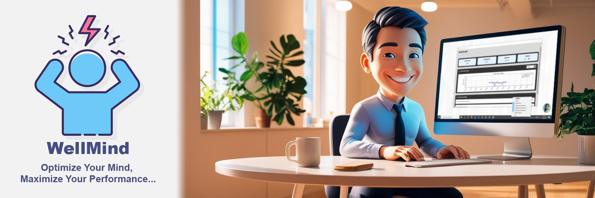
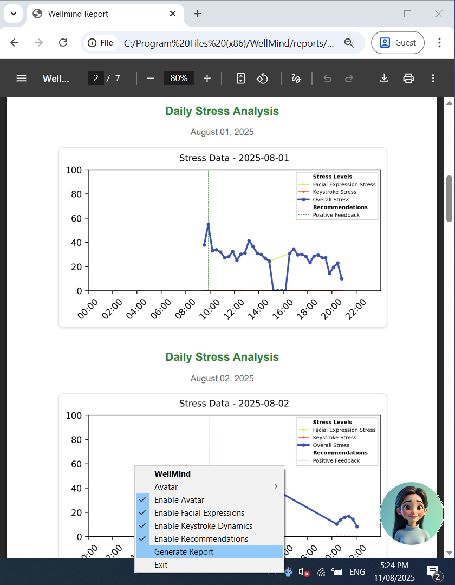

# WellMind – Your Smart Companion for a Stress-Free Workday!

## Discover WellMind

Tired of high-pressure deadlines leaving you drained? **WellMind** is your ultimate Windows app designed especially for IT pros like you! It gently monitors stress using your webcam and keyboard, delivering personalized tips to help you unwind and boost productivity. Stay calm, focused, and energized – all while keeping your data 100% private on your device. No internet, no hassle – just pure well-being!

## Exciting Features

-   **Effortless Stress Tracking**: Let WellMind watch your facial expressions and typing habits to spot stress during your daily grind.
-   **Tailored Wellness Tips**: Get instant, custom suggestions like deep breaths, quick stretches, or motivational breaks – perfectly suited to your needs!
-   **Customizable Interactive Avatar**: Your friendly and Customizable interactive avatar animates with computer actions, such as connecting a power cable or plugging in a USB device.
-   **Insightful Dashboard**: Dive into vibrant graphs showing your stress patterns daily, weekly, or monthly, plus a log of all your favorite tips.
-   **Total Privacy & Control**: Everything stays secure on your PC – no sharing, no worries!
-   **Easy Profile Setup**: Build your personal space and manage it anytime for peace of mind.
-   **Quick Tray Access**: Toggle features, grab stress reports, or quit with a simple click – you're in charge!

## What You Need to Get Started

-   **Operating System**: Windows 10 or 11 – seamless compatibility for your everyday setup!
    
-   **Hardware Essentials**:
    
    -   **RAM**: Minimum 4GB (8GB recommended for optimal performance)
        
    -   **Processor**: Minimum Intel i3 or AMD Ryzen 3 equivalent
        
    -   **Webcam**: Integrated or dedicated webcam for facial expression analysis
        
    -   **Keyboard**: Standard keyboard for keystroke dynamics monitoring
        
    -   **Storage**: Minimum 2GB free disk space for local data storage (e.g., user profiles, stress history)

## Simple Installation

1.  Grab the latest WellMind setup from our GitHub releases – it's free and ready to go!
2.  Install it on your computer and restart the computer.
3.  When your computer starts, enter your personal information (name, gender, birthday) to set up your profile.
4.  After setup, start monitoring stress, follow the recommendations, and improve your effectiveness!

## How to Use WellMind

1.  **Jump Right In**:
    -   Launch the app, add your details (name, gender, birthday), and let it personalize just for you.
    -   It runs quietly in the background, keeping an eye on your well-being.
2.  **Stress Detection Made Easy**:
    -   WellMind scans your expressions and keystrokes as you work.
    -   Every 20 minutes, it checks in – if stress spikes, a tip appears to brighten your day!
3.  **Explore the Dashboard**:
    -   Pop open the main view for real-time stress scores and colorful trend graphs.
    -   Review past tips in the recommendations section.
4.  **Play with the Avatar**:  
    -   Your customizable avatar floats on your screen, animating with computer actions like connecting a charger or USB device.
    -   It shares tips when you need them most – drag it around, or tweak its behavior to suit you!
5.  **Tray Menu Magic**:
    -   Right-click the icon to switch things on/off, pull up reports, or sign off effortlessly.

## Stunning Screenshots

### User Onboarding

  
_Kick off your journey with a quick, welcoming setup!_

### Dashboard

  
_Unlock insights into your stress trends and empowering suggestions!_

### Interactive Avatar

  
_Your lively sidekick sharing tips and responding to your world!_

### WellMind Report

  
_Daily breakdowns of stress levels – see what times you felt the pressure and how to conquer it!_

## Need Help?

Questions or feedback? Head to our GitHub and drop us a note – we're here to make your experience amazing!

## Shoutouts

Born from a final-year research project by G. H. N. Thilakarathna, J. R. Gamlath, and W. A. P. P. Ishan at the Department of ICT, Faculty of Technology, University of Colombo (August 2025, 19/20 Batch - Group 20).